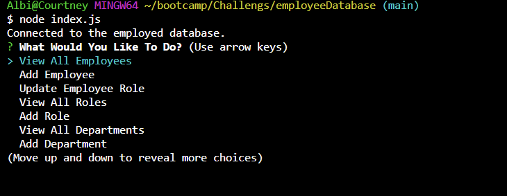
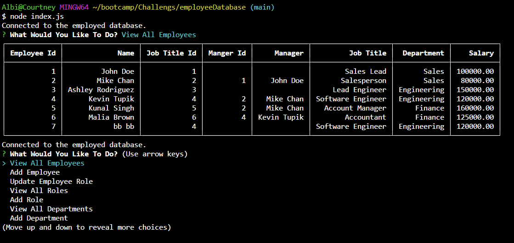
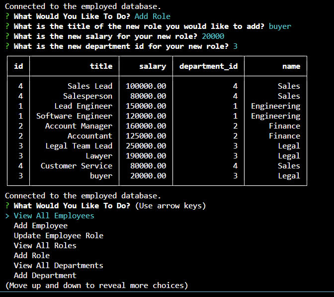

# Employee Database

## Badges

## Description

- Motivation: My motivation for this porject was to really test my knowleadge with mysql and how see how it can be used in a somewhat real world example
- Goal: I built this project for possible employers or companies to have an easy way to access there employee database
- Problems Solved: The problem it solves is having a clean neat way that is saved for all your employee's data
- What I Learned: There are many things i learned, the full utilization of async functions and await, how choice within inquirer can be really annoying when relating to a db.query value, I somewhat understand how to join tables through the help of my piers and my tutor, and the most important thing i learned is how annoying this challenege truly was

## Installation

npm
node.js
inquierer
mysql2
console-table-printer

## Usage

## Credits

N/A

## License

This program is done under the license: [MIT License](https://choosealicense.com/licenses/mit/)

## How To Contribute

## Questions

GitHub: https://github.com/Albikras

If you want to reach me with additional question click my email link here: Krasniqi1287@gmail.com

## Video

https://github.com/Albikras/employeeDatabase/assets/124819029/d8204312-b26a-4f39-9075-742b193b7c4c

